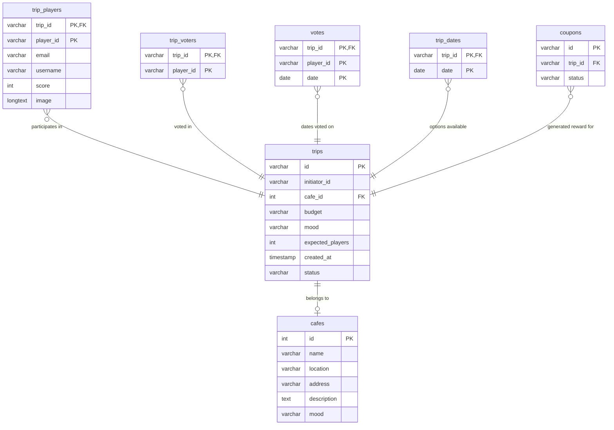

# Team 10 - Integration 4

## Basic info
### Team members
- Keanu PLYSIER (Code)
- Dmytro ANASTASIY (UX - Visual)
- Laura DOOLAEGE (UX - Visual)
- Huyen PHAM (UX - Visual - Manager)

### Important links
- Figjam Whiteboard: [Figma Board](https://www.figma.com/board/GvB9QkGIXz632RKZus2q53/VISIT-ANTWERP?node-id=366-2263&t=gzRq3efQtVc7uo31-1)
- Figma Design: [Figma Board](https://www.figma.com/board/GvB9QkGIXz632RKZus2q53/VISIT-ANTWERP?node-id=366-2263&t=gzRq3efQtVc7uo31-1)
- SCRUM Project: [GitHub Projects](https://github.com/users/LauraDoolaege/projects/1/views/1)

### Project Overview
The **Trip Planning Application** (Visit Antwerp) is a collaborative platform designed to help groups coordinate, vote and pick dates.It is a interactive webApp to help trips to antwerp make it out of the groups chat. upload character avatars, and earn coupons. It supports real-time synchronization and email notifications for participants.

### Technologies Used
*   **Frontend**: React 19, React Router 7, Vite 8, flatpickr, and socket.io-client.
*   **Backend**: Node.js, Express 5, Nodemailer, and MJML (email templates).
*   **Database**: MySQL (via `mysql2`) and JSON-Server (for mock API endpoints).
*   **Containerization**: Docker Compose (MySQL and phpMyAdmin containers).

---

# Local Development Setup & Guide (Dev Version)

> [!IMPORTANT]
> This guide and setup process are strictly configured for **Local Development (Dev Version)**. The configurations, environment settings, and database containers described below are intended for running the project on a local workstation and should not be used in production. For production environments, refer to the [Production Setup & Deployment Guide (Hosted Version)](#production-setup--deployment-guide-hosted-version) below.

This guide details the system requirements, configuration settings, external services, database schemas, and step-by-step setup instructions for running the **local development version** of the application components located under the [fullApp/](file:///Users/keanuplysier/Documents/School/25-26/INT4/fullApp/) directory.

## 1. System Requirements (Local Dev)

*   **Operating System**: macOS, Windows 10/11, or Linux.
*   **Internet Connection**: Required for initial dependency installation, Docker image downloads, and SMTP email services.
*   **Runtime Environment**: Node.js **v18.x** or higher (LTS recommended) and **npm v9.x** or higher.
*   **Docker Desktop**: Required to host the **local development** MySQL database and phpMyAdmin panel via Docker Compose.

---

## 2. Project Directory Structure

```text
├── fullApp/                  # Core development application logic
│   ├── client/               # React + Vite frontend application (Dev)
│   ├── server/               # Express HTTPS server +  database connectivity (Dev)
│   │   ├── certs/            # HTTPS local SSL certificate keys
│   │   ├── db/               # MySQL seed SQL files and JSON mocks
│   │   └── services/         # Mailer and Database connection adapters
│   └── docker-compose.yml    # Configures the local MySQL + phpMyAdmin database containers (Local Dev)
├── production/               # Production configuration & Combel deployment target
│   ├── client/               # React + Vite frontend application (Prod config)
│   ├── server/               # Backend API server configurations & packages (Prod config)
│   └── docker-compose.yml    # Configures production database containers (Production)
└── test/                     # Testing & Hardware prototyping environment (Mock API/ESP32 Arduino files)
```

---

## 3. Local Dev Environment Variables Configuration (`.env`)

You need to set up environment configurations in **two locations** under `fullApp/`:

### A. Local Dev Docker Setup Environment File
Create a [fullApp/.env](file:///Users/keanuplysier/Documents/School/25-26/INT4/fullApp/.env) file using [fullApp/.env.example](file:///Users/keanuplysier/Documents/School/25-26/INT4/fullApp/.env.example) as a template. This configures database credentials for your **local dev** container:

```ini
DB_ROOT_PASSWORD=
DB_USER=
DB_PASSWORD=
DB_NAME=
```

### B. Local Dev Server Setup Environment File
Create a [fullApp/server/.env](file:///Users/keanuplysier/Documents/School/25-26/INT4/fullApp/server/.env) file using [fullApp/server/.env.example](file:///Users/keanuplysier/Documents/School/25-26/INT4/fullApp/server/.env.example) as a template. This links the API server to the **local dev** database, specifies the local HTTPS certificate, and sets up external mail integrations:

```ini
PORT=446                         # Port where the HTTPS backend server will run
SSL_KEY=./certs/key.pem          # Path to your SSL private key (local dev)
SSL_CERT=./certs/cert.pem        # Path to your SSL certificate (local dev)

EMAIL_USER=your-email@gmail.com  # Gmail username for sending transaction/trip emails
EMAIL_PASS=xxxx xxxx xxxx xxxx   # Google App Password (not your account password!)
PHASE=development                # Current environment execution stage (set to development)
FRONTEND_URL=...                 # Path config for client redirection URLs

DB_HOST=localhost                # Server database location (matching local docker-compose port mapping)
DB_USER=tripuser                 # MySQL User (matches local dev docker-compose config)
DB_PASSWORD=trippass             # MySQL Password (matches local dev docker-compose config)
DB_NAME=tripdb                   # MySQL database name (matches local dev docker-compose config)
```

---

## 4. Online Services Setup (Dev Version)

### SMTP Mail Notification Setup (Gmail API)
The local server uses **Nodemailer** to email trip details and coupon codes to participants during testing.
1. Log into your Google Account.
2. Navigate to **Google Account Settings** -> **Security** -> **2-Step Verification** (Ensure this is turned **ON**).
3. Under the *2-Step Verification* settings page, scroll down to the bottom and click on **App Passwords**.
4. In the "Select App" dropdown, select **Other (Custom Name)** and type a name (e.g. `TripPlanner-Dev`).
5. Click **Generate** and copy the **16-character code** generated on the screen.
6. Paste this code directly into your `EMAIL_PASS` field inside [fullApp/server/.env](file:///Users/keanuplysier/Documents/School/25-26/INT4/fullApp/server/.env) (without spaces).
7. Ensure your Gmail address is in the `EMAIL_USER` field.

---

## 5. Local Dev Database Schema & Import Setup

The application stores data relating to trips, cafes, registered players, votes, possible dates, and reward coupons in a local MySQL container database.

### Import Script
A pre-formatted schema file containing all tables, constraints, and 20 seeded cafe locations (matching the local dev fixtures in [fullApp/server/db/DB.json](file:///Users/keanuplysier/Documents/School/25-26/INT4/fullApp/server/db/DB.json)) is located at [fullApp/server/db/schema.sql](file:///Users/keanuplysier/Documents/School/25-26/INT4/fullApp/server/db/schema.sql). Below is the complete database schema and initial data required for the project:

```sql
-- 1. Create Tables
CREATE TABLE IF NOT EXISTS cafes (
  id VARCHAR(55) PRIMARY KEY,
  name VARCHAR(255) NOT NULL,
  location VARCHAR(255) NOT NULL,
  address VARCHAR(255) DEFAULT '',
  description TEXT,
  mood VARCHAR(100) NOT NULL
);

CREATE TABLE IF NOT EXISTS trips (
  id VARCHAR(255) PRIMARY KEY,
  initiator_id VARCHAR(255) NOT NULL,
  cafe_id VARCHAR(55) NOT NULL,
  budget INT NOT NULL,
  mood VARCHAR(100) NOT NULL,
  expected_players INT NOT NULL,
  created_at DATE NOT NULL,
  status VARCHAR(50) DEFAULT 'open',
  FOREIGN KEY (cafe_id) REFERENCES cafes(id)
);

CREATE TABLE IF NOT EXISTS coupons (
  id VARCHAR(255) PRIMARY KEY,
  trip_id VARCHAR(255) NOT NULL,
  status VARCHAR(50) DEFAULT 'active',
  FOREIGN KEY (trip_id) REFERENCES trips(id) ON DELETE CASCADE
);

CREATE TABLE IF NOT EXISTS trip_players (
  trip_id VARCHAR(255) NOT NULL,
  player_id VARCHAR(255) NOT NULL,
  email VARCHAR(255) NOT NULL,
  username VARCHAR(100) NOT NULL,
  score INT DEFAULT 0,
  image LONGTEXT, -- Stores base64 captured character avatar
  PRIMARY KEY (trip_id, player_id),
  FOREIGN KEY (trip_id) REFERENCES trips(id) ON DELETE CASCADE
);

CREATE TABLE IF NOT EXISTS trip_voters (
  trip_id VARCHAR(255) NOT NULL,
  player_id VARCHAR(255) NOT NULL,
  PRIMARY KEY (trip_id, player_id),
  FOREIGN KEY (trip_id) REFERENCES trips(id) ON DELETE CASCADE
);

CREATE TABLE IF NOT EXISTS votes (
  id INT AUTO_INCREMENT PRIMARY KEY,
  trip_id VARCHAR(255) NOT NULL,
  player_id VARCHAR(255) NOT NULL,
  date DATE NOT NULL,
  FOREIGN KEY (trip_id) REFERENCES trips(id) ON DELETE CASCADE
);

CREATE TABLE IF NOT EXISTS trip_dates (
  trip_id VARCHAR(255) NOT NULL,
  date DATE NOT NULL,
  PRIMARY KEY (trip_id, date),
  FOREIGN KEY (trip_id) REFERENCES trips(id) ON DELETE CASCADE
);

-- 2. Populate Cafes
INSERT INTO cafes (id, name, location, address, description, mood) VALUES
('1', 'Brouwers Vojta', 'Antwerp', 'Steenplein 1, 2000 Antwerpen', 'Popular beer café with Belgian craft brews and lively atmosphere', 'Beer & Banter'),
('2', 'De Koninck Brewery Café', 'Antwerp', 'Mechelsesteenweg 291, 2018 Antwerpen', 'Historic brewery café serving Antwerp\'s famous De Koninck beer', 'Beer & Banter'),
('3', 'Café Slaghuis', 'Antwerp', 'Sint-Jacobsmarkt 2, 2000 Antwerpen', 'Traditional Antwerp café with Belgian beer selection', 'Beer & Banter'),
('4', 'The Distillery', 'Antwerp', 'Grote Markt 12, 2000 Antwerpen', 'Historic pub in the city center with craft beers and spirits', 'Beer & Banter'),
('5', 'Puur Cocktail Bar', 'Antwerp', 'Kloosterstraat 8, 2000 Antwerpen', 'Craft cocktail bar with inventive drinks and minimalist design', 'Cocktails, darling'),
('6', 'Bar Bohem', 'Antwerp', 'Kammenstraat 10, 2000 Antwerpen', 'Bohemian cocktail bar with creative mixology and eclectic vibe', 'Cocktails, darling'),
('7', 'Café de Pelgrom', 'Antwerp', 'Pelgrimsstraat 15, 2000 Antwerpen', 'Historic café-bar with cocktails and vintage atmosphere', 'Cocktails, darling'),
('8', 'The Shelter', 'Antwerp', 'Nationalestraat 34, 2000 Antwerpen', 'Underground speakeasy-style cocktail bar with craft drinks', 'Cocktails, darling'),
('9', 'Vinoteca', 'Antwerp', 'Vlaeykensgang 16, 2000 Antwerpen', 'Wine bar with curated selection and knowledgeable staff', 'Wine & refined'),
('10', 'Wijnbar Bacchus', 'Antwerp', 'Steenhouwersvest 28, 2000 Antwerpen', 'Elegant wine bar with fine selections and tapas pairings', 'Wine & refined'),
('11', 'Château Rouge', 'Antwerp', 'Schuttershofstraat 42, 2000 Antwerpen', 'Refined wine lounge with French-inspired ambiance', 'Wine & refined'),
('12', 'De Groote Witte Arend', 'Antwerp', 'Reyndersstraat 18, 2000 Antwerpen', 'Traditional Belgian beer hall with rustic charm', 'Beer & Banter'),
('13', 'Motley', 'Antwerp', 'Groenplaats 1, 2000 Antwerpen', 'Trendy café with creative non-alcoholic drinks and laid-back vibe', 'Mocktails & chill'),
('14', 'Juice Lab', 'Antwerp', 'Nationalestraat 55, 2000 Antwerpen', 'Health-focused juice bar with smoothies and wellness drinks', 'Mocktails & chill'),
('15', 'Café Pelgrom', 'Antwerp', 'Pelgrimsstraat 15, 2000 Antwerpen', 'Cozy café serving herbal teas and fresh juices', 'Mocktails & chill'),
('16', 'Het Fornuis', 'Antwerp', 'Reyndersstraat 27, 2000 Antwerpen', 'Casual neighbourhood bar with Belgian beers and pub atmosphere', 'Beer & Banter'),
('17', 'Café Local', 'Antwerp', 'Waalsekaai 25, 2000 Antwerpen', 'Authentic local bar with craft beer focus and friendly crowd', 'Beer & Banter'),
('18', 'The Lab', 'Antwerp', 'Kammenstraat 48, 2000 Antwerpen', 'Modern cocktail laboratory with experimental drinks', 'Cocktails, darling'),
('19', 'Terra Wines', 'Antwerp', 'Kloosterstraat 35, 2000 Antwerpen', 'Natural wine bar with organic selections and intimate setting', 'Wine & refined'),
('20', 'Zen Café', 'Antwerp', 'Mechelseplein 12, 2000 Antwerpen', 'Peaceful sanctuary with herbal teas and wellness focus', 'Mocktails & chill');
```

### Database Structure
The table structures defined in the database schema:



To import the local database manually:
1. Open your database administration tool (e.g. phpMyAdmin at `http://localhost:8080` once Docker is running).
2. Go to the `Import` tab.
3. Select [fullApp/server/db/schema.sql](file:///Users/keanuplysier/Documents/School/25-26/INT4/fullApp/server/db/schema.sql) and run it.

---

## 6. Step-by-Step Local Setup & Run Guide

Follow these terminal instructions to spin up the local development environment:

### Step 1: Install Dependencies
Open your terminal and install dependencies for both the front-end client and the server:
```bash
# Go to client folder and install dependencies
cd fullApp/client
npm install

# Go to server folder and install dependencies
cd ../server
npm install
```

### Step 2: Set Up SSL Certificates
The local backend uses HTTPS. Ensure that you have valid SSL keys inside [fullApp/server/certs/](file:///Users/keanuplysier/Documents/School/25-26/INT4/fullApp/server/certs/). If they are missing, you can generate temporary keys for **local testing**:
```bash
# OpenSSL Command to generate development keys:
cd fullApp/server/certs
openssl req -nodes -new -x509 -keyout key.pem -out cert.pem -days 365
```

### Step 3: Run the Database Services (Docker Compose)
Start the Docker daemon on your computer, navigate to `fullApp`, and spin up the local database container:
```bash
cd fullApp
docker compose up -d
```
*Note: This starts MySQL (port `3306`) and phpMyAdmin (accessible locally at `http://localhost:8080`).*

### Step 4: Import Database Tables
Import the schema from [fullApp/server/db/schema.sql](file:///Users/keanuplysier/Documents/School/25-26/INT4/fullApp/server/db/schema.sql) into the **local container database**:
```bash
docker exec -i trip-mysql mysql -u tripuser -ptrippass tripdb < server/db/schema.sql
```

### Step 5: Start Local Development Mode
To launch the backend server (which mounts and runs the Vite client as middleware):
```bash
cd server
npm run dev
```

*   **Client App Port**: The combined HTTPS client+server is served over the local port specified in `fullApp/server/.env` (typically `https://localhost:446`).
*   **JSON-Server Mock API**: Runs concurrently in development mode on port `3000`.

> [!TIP]
> **Multi-Device Testing (IP Address)**: For local development, the server can be accessed through your machine's local IP address (e.g., `https://192.168.x.x:446`) instead of `localhost`. This enables other devices (like smartphones, tablets, or ESP32 hardware prototypes) on the same Wi-Fi network to connect to and use the web application.

---

## 7. Testing Environment & Prototyping (`test/` Directory)

The project includes a [test/](file:///Users/keanuplysier/Documents/School/25-26/INT4/test/) folder. This contains mock implementations, device sketches, and testing scripts used during design phases:

*   [test/game/](file:///Users/keanuplysier/Documents/School/25-26/INT4/test/game/): Contains ESP32 hardware prototype micro-controller scripts (`.ino` files) and mock servers to test physical interaction modules.
*   [test/server/](file:///Users/keanuplysier/Documents/School/25-26/INT4/test/server/): A minimalist JSON Server setup used to quickly mock backend endpoints without database overhead.
*   [test/serverBased/](file:///Users/keanuplysier/Documents/School/25-26/INT4/test/serverBased/): Expanded mock server testing Socket.IO logic and Nodemailer capabilities under isolation.
*   [test/websockets/](file:///Users/keanuplysier/Documents/School/25-26/INT4/test/websockets/): Sandbox environment to prototype bi-directional client-server events.

---

# Production Setup & Deployment Guide (Hosted Version)

> [!IMPORTANT]
> This guide and setup process are configured for **Production Deployment (Hosted Version)**, specifically targeting Combel hosting. For local development, refer to the [Local Development Setup & Guide (Dev Version)](#local-development-setup--guide-dev-version) above.

This guide details the system requirements, configuration settings, database schema setup, and steps for deploying both the client frontend and backend API server to production hosting (e.g., Combel).

## 1. System Requirements (Hosted/Production)

*   **Operating System**: macOS 12+, Windows 10/11, or Linux (Ubuntu 20.04+).
*   **Node.js**: Version `v18.x` or `v20.x` (LTS versions recommended).
*   **Package Manager**: `npm v9.x` or higher.
*   **Database**: MySQL v8.0+ (or compatible MariaDB).
*   **Network**: A stable internet connection is required to fetch npm packages, send email notifications via SMTP, and download assets.

---

## 2. Production Environment Variables Configuration (`.env`)

You need to set up environment configurations for both the client (frontend) and server (backend):

### A. Production Client Setup Environment File
Create a [fullApp/client/.env](file:///Users/keanuplysier/Documents/School/25-26/INT4/fullApp/client/.env) file locally in your client folder. This is used during local runs and when building with `npm run build`:

```ini
VITE_API_URL=https://api.websiteName.be # The URL pointing to your deployed backend API (no trailing slash)
```

### B. Production Server Setup Environment File
Input these settings directly inside your **Combel Node.js Application Settings** dashboard (or place them in a [fullApp/server/.env](file:///Users/keanuplysier/Documents/School/25-26/INT4/fullApp/server/.env) file using [fullApp/server/.env.example](file:///Users/keanuplysier/Documents/School/25-26/INT4/fullApp/server/.env.example) as a template if running locally):

```ini
API_BASE_URL=https://api.websiteName.be # The base URL of your server
FRONTEND_URL=https://websiteName.be/planA # The URL of your hosted React app
PHASE=production                 # Set to 'production' for live server, or 'development' for local
EMAIL_USER=your-email@gmail.com  # Gmail username for sending transaction/trip emails
EMAIL_PASS=xxxx xxxx xxxx xxxx   # Google App Password (not your account password!)

DB_HOST=localhost                # Usually 'localhost' or '127.0.0.1' on Combel
DB_PORT=3306                     # Database port (typically 3306)
DB_USER=your-username            # Your Combel Database username
DB_PASSWORD=your-password        # Your Combel Database password
DB_NAME=your-database-name       # Your Combel Database name
```

---

## 3. Database Setup (Import Schema)

Refer to the [Import Script](#import-script) section under [Local Dev Database Schema & Import Setup](#5-local-dev-database-schema--import-setup) for the complete SQL schema and initial data inserts required to initialize the database (both local and Combel environments share the same schema).

---

## 4. Deploying to Production Hosting (Combel)

Because Combel blocks external incoming database requests, **both your database and Node.js server must be hosted within the Combel environment**.

### A. Combel Database Import
1.  Log in to your Combel Control Panel.
2.  Create a MySQL database and copy the connection credentials (hostname, database name, user, and password).
3.  Open phpMyAdmin inside Combel, select your new database, click the **Import** tab, upload the `schema.sql` file containing the tables and café data, and click **Go**.

### B. Frontend Deployment (`/planA/`)
1.  Navigate to the local client folder:
    ```bash
    cd fullApp/client
    ```
2.  Open your [vite.config.js](file:///Users/keanuplysier/Documents/School/25-26/INT4/fullApp/client/vite.config.js) and verify `base: '/planA/'` is set.
3.  Open [src/main.jsx](file:///Users/keanuplysier/Documents/School/25-26/INT4/fullApp/client/src/main.jsx) and verify the basename parameter is `basename: "/planA"`.
4.  Generate the production build:
    ```bash
    npm run build
    ```
    This compiles all files into the [dist/](file:///Users/keanuplysier/Documents/School/25-26/INT4/fullApp/client/dist/) directory.
5.  Using FileZilla (ensure "Force showing hidden files" is enabled), drag all contents inside the local [dist/](file:///Users/keanuplysier/Documents/School/25-26/INT4/fullApp/client/dist/) folder into your server's root folder inside a directory named `planA/`.
    *   **Crucial Step**: Verify that the `.htaccess` file was successfully uploaded to `planA/.htaccess` on the server so that nested React Router URLs (like `planA/friend/...`) redirect to index.html without throwing a 404.

### C. Backend Deployment (via Combel GitHub Integration)
1.  **Set up Website/Subdomain on Combel**:
    *   Log in to your Combel Control Panel.
    *   Create a dedicated subdomain or website specifically where your backend API server will live (e.g., `api.websiteName.be`).
    *   Under the web hosting configuration settings for this domain, **select Node.js** as the application hosting environment.
2.  **Git Push**: Push your repository directly to your connected GitHub repository. Combel will automatically pull the latest server code changes.
3.  **Node.js Application Configuration**:
    *   In the Combel Control Panel Node.js manager, set the Node.js Application root to point to the [fullApp/server](file:///Users/keanuplysier/Documents/School/25-26/INT4/fullApp/server) directory.
    *   Set the startup script to [index.js](file:///Users/keanuplysier/Documents/School/25-26/INT4/fullApp/server/index.js).
4.  **Configure Environment Variables**:
    *   Since sensitive files like `.env` are excluded from Git ([.gitignore](file:///Users/keanuplysier/Documents/School/25-26/INT4/.gitignore)), you must configure your server variables (database host, username, password, Gmail SMTP credentials, `FRONTEND_URL=https://website.be/planA`, etc.) directly inside the Combel Control Panel's **Environment Variables** settings.
5.  **Install Dependencies & Restart**:
    *   Combel will run the dependency installation (`npm install`) automatically.
    *   Restart the Node.js application in your Combel control panel to load the new environment variables and initialize the database connection pool.
