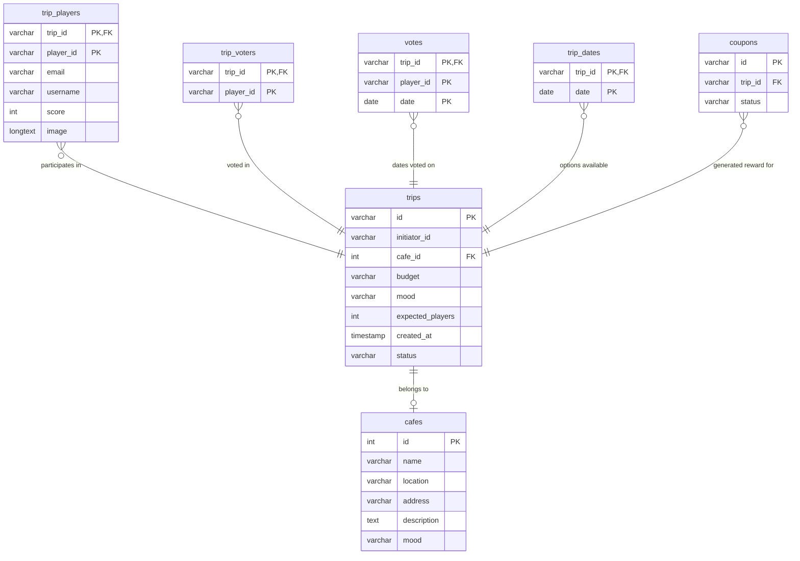

# Team 10 - Integration 4

## Basic info
### Team members
- Keanu PLYSIER (Code)
- Dmytro ANASTASIY (UX - Visual)
- Laura DOOLAEGE (UX - Visual)
- Huyen PHAM (UX - Visual - Manager)

### Important links
- Figjam Whiteboard: [Figma Board](https://www.figma.com/board/GvB9QkGIXz632RKZus2q53/VISIT-ANTWERP?node-id=366-2263&t=gzRq3efQtVc7uo31-1)
- Figma Design: [Figma Board](https://www.figma.com/board/GvB9QkGIXz632RKZus2q53/VISIT-ANTWERP?node-id=366-2263&t=gzRq3efQtVc7uo31-1)
- SCRUM Project: [GitHub Projects](https://github.com/users/LauraDoolaege/projects/1/views/1)

---

# Local Development Setup & Guide (Dev Version)

> [!IMPORTANT]
> This guide and setup process are strictly configured for **Local Development (Dev Version)**. The configurations, environment settings, and database containers described below are intended for running the project on a local workstation and should not be used in production.

This guide details the system requirements, configuration settings, external services, database schemas, and step-by-step setup instructions for running the **local development version** of the application components located under the [fullApp/](file:///Users/keanuplysier/Documents/School/25-26/INT4/fullApp/) directory.

## 1. System Requirements (Local Dev)

*   **Operating System**: macOS, Windows 10/11, or Linux.
*   **Internet Connection**: Required for initial dependency installation, Docker image downloads, and SMTP email services.
*   **Runtime Environment**: Node.js **v18.x** or higher (LTS recommended) and **npm v9.x** or higher.
*   **Docker Desktop**: Required to host the **local development** MySQL database and phpMyAdmin panel via Docker Compose.

---

## 2. Project Directory Structure

```text
├── fullApp/                  # Core application logic
│   ├── client/               # React + Vite frontend application
│   ├── server/               # Express HTTPS server + Socket.IO + database connectivity
│   │   ├── certs/            # HTTPS local SSL certificate keys
│   │   ├── db/               # MySQL seed SQL files and JSON mocks
│   │   └── services/         # Mailer and Database connection adapters
│   └── docker-compose.yml    # Configures the local MySQL + phpMyAdmin database containers (Local Dev)
└── test/                     # Testing & Hardware prototyping environment (Mock API/ESP32 Arduino files)
```

---

## 3. Local Dev Environment Variables Configuration (`.env`)

You need to set up environment configurations in **two locations** under `fullApp/`:

### A. Local Dev Docker Setup Environment File
Create a [fullApp/.env](file:///Users/keanuplysier/Documents/School/25-26/INT4/fullApp/.env) file using [fullApp/.env.example](file:///Users/keanuplysier/Documents/School/25-26/INT4/fullApp/.env.example) as a template. This configures database credentials for your **local dev** container:

```ini
DB_ROOT_PASSWORD=rootpass
DB_USER=tripuser
DB_PASSWORD=trippass
DB_NAME=tripdb
```

### B. Local Dev Server Setup Environment File
Create a [fullApp/server/.env](file:///Users/keanuplysier/Documents/School/25-26/INT4/fullApp/server/.env) file using [fullApp/server/.env.example](file:///Users/keanuplysier/Documents/School/25-26/INT4/fullApp/server/.env.example) as a template. This links the API server to the **local dev** database, specifies the local HTTPS certificate, and sets up external mail integrations:

```ini
PORT=446                         # Port where the HTTPS backend server will run
SSL_KEY=./certs/key.pem          # Path to your SSL private key (local dev)
SSL_CERT=./certs/cert.pem        # Path to your SSL certificate (local dev)
API_BASE_URL=http://localhost:3000 # Host URL for local dev mock API endpoints
EMAIL_USER=your-email@gmail.com  # Gmail username for sending transaction/trip emails
EMAIL_PASS=xxxx xxxx xxxx xxxx   # Google App Password (not your account password!)
PHASE=development                # Current environment execution stage (set to development)
FRONTEND_URL=...                 # Path config for client redirection URLs

DB_HOST=localhost                # Server database location (matching local docker-compose port mapping)
DB_USER=tripuser                 # MySQL User (matches local dev docker-compose config)
DB_PASSWORD=trippass             # MySQL Password (matches local dev docker-compose config)
DB_NAME=tripdb                   # MySQL database name (matches local dev docker-compose config)
```

---

## 4. Online Services Setup (Dev Version)

### SMTP Mail Notification Setup (Gmail API)
The local server uses **Nodemailer** to email trip details and coupon codes to participants during testing.
1. Log into your Google Account.
2. Navigate to **Google Account Settings** -> **Security** -> **2-Step Verification** (Ensure this is turned **ON**).
3. Under the *2-Step Verification* settings page, scroll down to the bottom and click on **App Passwords**.
4. In the "Select App" dropdown, select **Other (Custom Name)** and type a name (e.g. `TripPlanner-Dev`).
5. Click **Generate** and copy the **16-character code** generated on the screen.
6. Paste this code directly into your `EMAIL_PASS` field inside [fullApp/server/.env](file:///Users/keanuplysier/Documents/School/25-26/INT4/fullApp/server/.env) (without spaces).
7. Ensure your Gmail address is in the `EMAIL_USER` field.

---

## 5. Local Dev Database Schema & Import Setup

The application stores data relating to trips, cafes, registered players, votes, possible dates, and reward coupons in a local MySQL container database.

### Import Script
A pre-formatted schema file containing all tables, constraints, and 20 seeded cafe locations (matching the local dev fixtures in [fullApp/server/db/DB.json](file:///Users/keanuplysier/Documents/School/25-26/INT4/fullApp/server/db/DB.json)) is located at [fullApp/server/db/schema.sql](file:///Users/keanuplysier/Documents/School/25-26/INT4/fullApp/server/db/schema.sql).

### Database Structure
The table structures defined in the database schema:



To import the local database manually:
1. Open your database administration tool (e.g. phpMyAdmin at `http://localhost:8080` once Docker is running).
2. Go to the `Import` tab.
3. Select [fullApp/server/db/schema.sql](file:///Users/keanuplysier/Documents/School/25-26/INT4/fullApp/server/db/schema.sql) and run it.

---

## 6. Step-by-Step Local Setup & Run Guide

Follow these terminal instructions to spin up the local development environment:

### Step 1: Install Dependencies
Open your terminal and install dependencies for both the front-end client and the server:
```bash
# Go to client folder and install dependencies
cd fullApp/client
npm install

# Go to server folder and install dependencies
cd ../server
npm install
```

### Step 2: Set Up SSL Certificates
The local backend uses HTTPS. Ensure that you have valid SSL keys inside [fullApp/server/certs/](file:///Users/keanuplysier/Documents/School/25-26/INT4/fullApp/server/certs/). If they are missing, you can generate temporary keys for **local testing**:
```bash
# OpenSSL Command to generate development keys:
cd fullApp/server/certs
openssl req -nodes -new -x509 -keyout key.pem -out cert.pem -days 365
```

### Step 3: Run the Database Services (Docker Compose)
Start the Docker daemon on your computer, navigate to `fullApp`, and spin up the local database container:
```bash
cd fullApp
docker compose up -d
```
*Note: This starts MySQL (port `3306`) and phpMyAdmin (accessible locally at `http://localhost:8080`).*

### Step 4: Import Database Tables
Import the schema from [fullApp/server/db/schema.sql](file:///Users/keanuplysier/Documents/School/25-26/INT4/fullApp/server/db/schema.sql) into the **local container database**:
```bash
docker exec -i trip-mysql mysql -u tripuser -ptrippass tripdb < server/db/schema.sql
```

### Step 5: Start Local Development Mode
To launch the backend server (which mounts and runs the Vite client as middleware):
```bash
cd server
npm run dev
```

*   **Client App Port**: The combined HTTPS client+server is served over the local port specified in `fullApp/server/.env` (typically `https://localhost:446`).
*   **JSON-Server Mock API**: Runs concurrently in development mode on port `3000`.

---

## 7. Testing Environment & Prototyping (`test/` Directory)

The project includes a [test/](file:///Users/keanuplysier/Documents/School/25-26/INT4/test/) folder. This contains mock implementations, device sketches, and testing scripts used during design phases:

*   [test/game/](file:///Users/keanuplysier/Documents/School/25-26/INT4/test/game/): Contains ESP32 hardware prototype micro-controller scripts (`.ino` files) and mock servers to test physical interaction modules.
*   [test/server/](file:///Users/keanuplysier/Documents/School/25-26/INT4/test/server/): A minimalist JSON Server setup used to quickly mock backend endpoints without database overhead.
*   [test/serverBased/](file:///Users/keanuplysier/Documents/School/25-26/INT4/test/serverBased/): Expanded mock server testing Socket.IO logic and Nodemailer capabilities under isolation.
*   [test/websockets/](file:///Users/keanuplysier/Documents/School/25-26/INT4/test/websockets/): Sandbox environment to prototype bi-directional client-server events.
